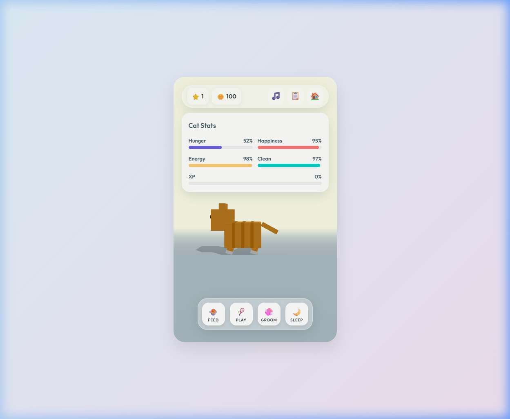

# 🧶 Daily Pixel Cat 🐾

Welcome to the coziest corner of the internet! **Daily Pixel Cat** is a relaxing 3D virtual pet game built with Three.js. Breed, feed, and play with your pixelated feline friends in a beautiful, glassmorphic interface.

## ✨ Features

- **🐱 Beautiful 3D Cats**: Meet various breeds, from the classic Tabby to the rare Golden Cat!
- **📦 Daily Task System**: Complete fun tasks every day to earn 🪙 coins and XP.
- **🎵 Lo-Fi Vibes**: Relax with a chill lo-fi soundtrack while you hang out with your cat.
- **🛠️ Modular UI**: A clean, responsive, and centered HUD designed for both desktop and mobile.
- **🧶 Interactive Toys**: Play with balls of yarn, feathers, and more to keep your cat happy!
- **🏠 Persistent Progress**: Your cat stats, inventory, and coins are saved automatically.

## 🚀 Getting Started

Simply open `index.html` in your favorite modern browser and start your adventure!

1. **Enter your nickname** to begin.
2. **Keep your cat happy**: Monitor hunger, energy, and cleanliness.
3. **Earn rewards**: Complete daily tasks to unlock new cats and toys.
4. **Relax**: Toggle the lo-fi music on or off using the 🎵 button.

## 🛠️ Developed With

- **Core**: Three.js (3D Engine)
- **Styling**: Vanilla CSS (Glassmorphism & Pixel-perfect layout)
- **Logic**: Vanilla JavaScript (ES6 Modules)
- **Audio**: Lo-fi royalty-free tracks

---

*Made with ❤️ for cat lovers everywhere. Stay cozy!* 🐱💤
